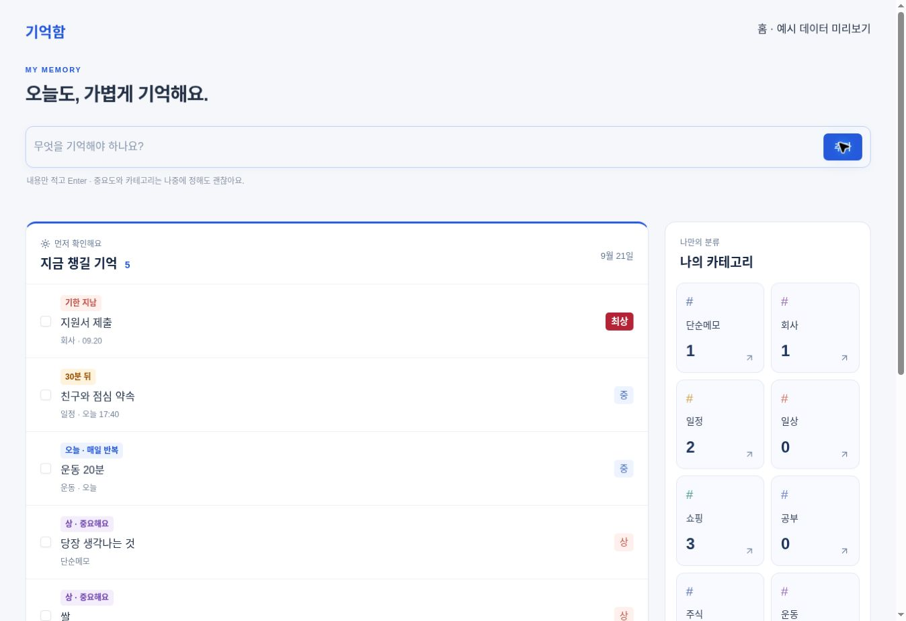

# 홈 화면 검토

브랜치: `feature/home-dashboard`

GitHub 기준 커밋: `0dd5b74ebb58ba31a051b4b4c6bce7d313999d62`
기존 Sites 기준 커밋: `5019806f9577339b5131e2c79740b73d139bf324` (운영 버전 29).

이 브랜치는 main에 병합하거나 운영 서비스에 배포하지 않았습니다.
검토를 취소하려면 main을 계속 사용하면 됩니다. 현재는 롤백 작업 자체가 필요하지 않습니다.
추후 병합했다면 병합 방식에 맞게 해당 변경을 revert하고 빌드·배포해야 합니다.
GitHub의 revert만으로 Sites 운영 버전이 자동 변경되지는 않습니다.
화면 변경만 포함하며 Firestore 데이터 형식과 기존 기록은 변경하지 않습니다.

## 구성

- 시작 화면과 로고 이동 대상을 홈으로 변경, 전체 메뉴 유지
- 빠른 입력 후 홈 유지
- 지금 챙길 기억: 기한 지남, 24시간 내 시간 지정 일정, 오늘, 중요도 상·최상 순
- 최초 6개와 더 보기, 반복 항목의 당일 완료 제외
- 최근 미완료 메모 5개와 전체 보기
- 기존 순서의 카테고리 카드와 미분류, 미완료 개수
- PC 두 열, 모바일은 챙길 기억 → 카테고리 → 최근 기억
- 홈에서 기존 완료 처리와 상세 편집 사용

## 확인

- TypeScript 검사 및 프로덕션 빌드 통과
- 현지 날짜·시간 기준 지연/임박, 다음 날 임박, 반복 완료 제외, 빈 목록과 정렬 검증
- 예시 데이터 전용 브라우저 화면에서 완료 처리, 카테고리 콜백, 빠른 입력 확인
- 실제 Firebase 로그인 상태의 통합 흐름 및 실제 모바일 기기는 미검증

아래 이미지는 홈 콘텐츠 컴포넌트를 예시 데이터로 표시한 검토 화면입니다.
운영 사용자 기록이나 실제 서비스 화면 캡처가 아닙니다. 실제 앱에는 기존 사이드바가 함께 표시됩니다.

